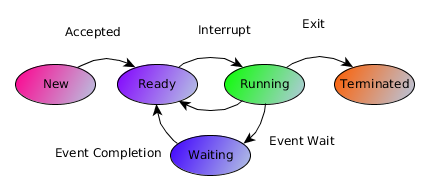

# Embedded Operating systems ITESO 2017


### Definitions.

- _*TCB*_: Task control block
- _*PCB*_: Process control block


### Process states:
A process is a program which is currently in execution. Differs from a program in
that a program is also a passive entity stored in disk.
Each process includes its own process stack to store temporary data:
  - Local variables
  - function parameters
  - return address

A process also includes a data section to contain global variables and heap-memory.
A process changes its state during its execution to one of the following states.
* New
  * The process just got created.
* Running
  * The process instructions are being executed.
* Waiting
  * The process is idle waiting for an external event such as I/O.
* Ready
  * The process is waiting for the processor.
* Terminated
  * There are no more instructions to execute.



### Locks

### Monitors

###  Semaphores

### Mutexs and Binary Semaphores

> What is the difference between Mutex and binary semaphore?

RV1: <> do not have ownership where as the !<> can only released by the one who
took the <>.

[1]: http://web.eecs.utk.edu/~mbeck/classes/cs560/360/notes/Setjmp/lecture.html "title"


### For Unix `setjmp/longjmp`
Setjmp() and longjmp() are subroutines that let you perform complex flow-of-control in C/Unix.
The state of a program depends completely of the state of the code, globals, heap, stack and
the content of its registers. The content of the registers includes the stack pointer, frame pointer
and program counter.

the instruction `setjmp()` does is to save the contents of the registers so that
`longjmp()` can store them later.  This way `longjmp()` _returns_ to the state
of the program when `setjmp()` was called.

```c
#include < setjmp.h >
int setjmp(jmp_buf env);
```


#### Preemption vs context switch

Preemption is the act of interrupting a process without its involvement. In this context, that probably means a timer interrupt will fire.

A context switch is what happens when the OS code (running preemptively) alters the state of the processor (the registers, mode, and stack) between one process or thread's context and another. The state of the processor may be at a certain line of code in a one thread. It will have temporary data in registers, a stack pointer at a certain region of memory, and other state information. A preemptive OS can store this state (either to static memory or onto the processes' stack) and load the state of a previous process. This is known as a context switch.


- - -

### Resources

#### PCB and diagram state
[http://www.hexainclude.com/process-state-diagram-and-pcb/](http://www.hexainclude.com/process-state-diagram-and-pcb/)


#### `setjmp()/longjmp()`
[http://web.eecs.utk.edu/~mbeck/classes/cs560/360/notes/Setjmp/lecture.html](http://web.eecs.utk.edu/~mbeck/classes/cs560/360/notes/Setjmp/lecture.html)
[https://es.wikipedia.org/wiki/Setjmp.h](https://es.wikipedia.org/wiki/Setjmp.h)
